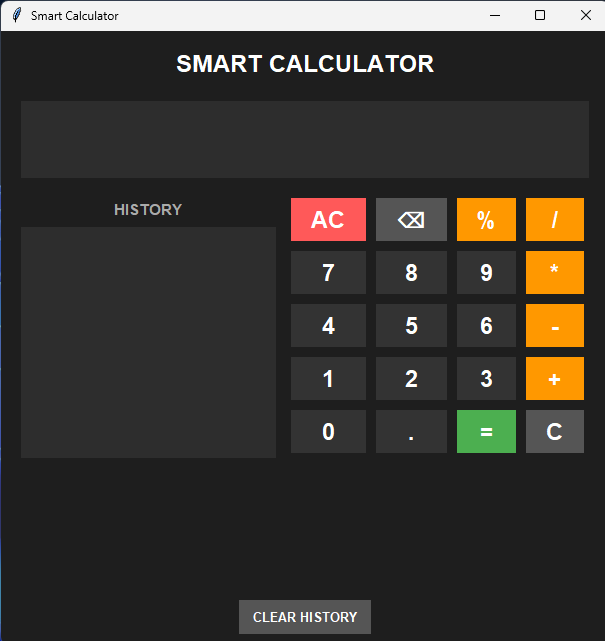

#  Smart Python Calculator

A modern desktop calculator application built using Python and Tkinter.

##  Features

- Addition
- Subtraction
- Multiplication
- Division
- Percentage calculation
- Decimal calculations
- Backspace
- Clear button
- Keyboard support
- Calculation history
- Error handling
- Safe expression evaluation
- Dark-themed graphical interface
- Resizable and maximizable window

##  Technologies Used

- Python 3
- Tkinter
- VS Code
- Git
- GitHub

##  Project Preview



## How to Run

1. Open the project folder in VS Code.
2. Make sure Python is installed.
3. Open the VS Code terminal.
4. Run the following command:

```bash
python calculator.py
 Learning Outcomes

Through this project, I practiced:

Python functions
Conditional statements
Loops
Exception handling
Tkinter GUI development
Event handling
Keyboard input
Safe expression evaluation
Calculation history
Basic project structure
Git and GitHub

# Author

Ash
